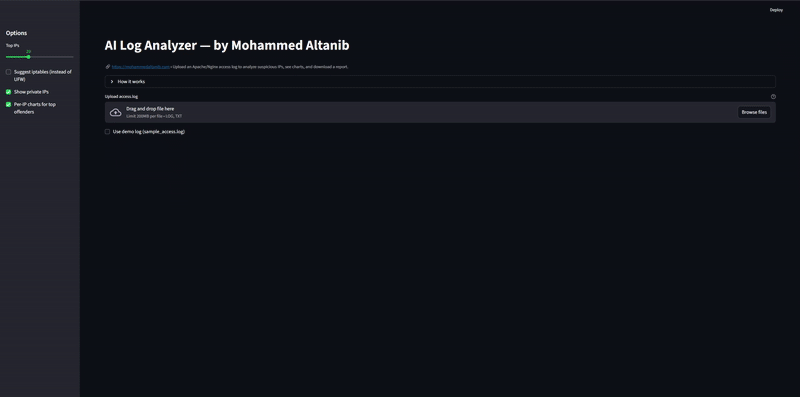

<p align="center">
  <a href="https://mohammedaltanib.com">
    
  </a>
</p>
<p align="center">
  <a href="https://mohammedaltanib.com">
    
  </a>
</p>

# AI Log Analyzer — Web UI (Streamlit) — by Mohammed Altanib

Upload an Apache/Nginx access log and get **ranked suspicious IPs**, **charts**, and **ready firewall rules** (UFW/iptables).  
Brand: **mohammedaltanib.com**

## Run locally
```bash
git clone https://github.com/MohammedAltanib/AiLog-Analyzer-Web.git
cd AiLog-Analyzer-Web/web
python3 -m venv .venv && source .venv/bin/activate
pip install -r requirements-web.txt
streamlit run app.py
```

## Run locally
```bash
cd web
python3 -m venv .venv && source .venv/bin/activate
pip install -r requirements-web.txt
streamlit run app.py
```

## Deploy (Streamlit Community Cloud)
1. Push this repo to GitHub.
2. Go to https://streamlit.io → **New app** → Choose your repo → set **file** to `web/app.py`.
3. Deploy. (Optional: custom domain)

## Deploy (Docker)
Create `Dockerfile` at repo root:
```dockerfile
FROM python:3.11-slim
WORKDIR /app
COPY web/requirements-web.txt /app/requirements.txt
RUN pip install --no-cache-dir -r requirements.txt
COPY web/app.py /app/app.py
COPY web/ai_log_analyzer.py /app/ai_log_analyzer.py
COPY web/sample_access.log /app/sample_access.log
ENV PORT=8501
EXPOSE 8501
CMD ["streamlit", "run", "app.py", "--server.port=8501", "--server.address=0.0.0.0"]
```

Build & run:
```bash
docker build -t ai-log-web .
docker run -p 8501:8501 ai-log-web
# open http://localhost:8501
```

## Notes
- Files uploaded in the app are processed in memory; adjust if you host it.
- This repo includes a dark theme: `.streamlit/config.toml`.
- Avoid committing real production logs.

## License
MIT © 2025 Mohammed Altanib
